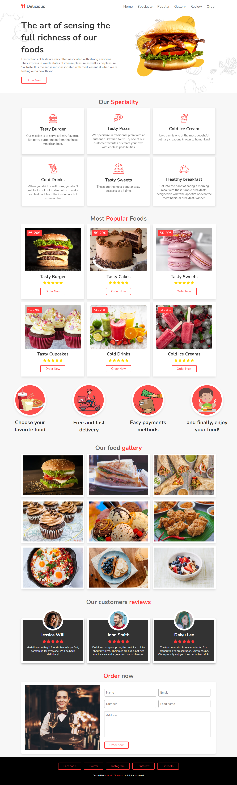

# Delicious
Delicious was a project where I was able to learn a lot about CSS. It is a complete and responsive website, with many details. 
## Display

## Home
In the first part, you have a hamburger that moves by itself. All the texts on this website were written by me, with the intention of giving the website more veracity. 
## Speciality
In this part we have 6 boxes, in each one you can read about our products and when you pass the mouse over it you can see a different image in each category.
## Popular 
In this part you have the price, a hover in the "order now" and the stars, as well as 4 images that show how easy it is to order in our restaurant.
## Gallery
In the gallery part you have different photos of the products.
## Reviews and Order now
Here you have the reviews of our customer as well as a form to place your order.
## Footer
In the last part we have the footer with all the social networks.
